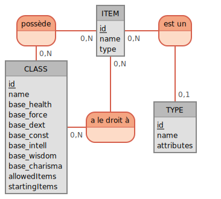

# 
 JDR Simulation 

## 
 Objectives 

The purpose of the project is to be able to simulate the damage taken by characters based on their class,
equipment, and statistics in a role-playing game world whose rules are derived from
a real tabletop role-playing game.

## 
 Technical specifications 

The project is composed of two technologies: Symfony and React.

Back-end side, I used Symfony to provide a robust and flexible data management. Moreover, Symfony is designed to
use best web development practices, such as respecting PSR coding standards and implementing unit and functional
tests. Finally, it is designed for large web applications, and is therefore easily scalable for future evolutions.

Front-end side, I used React because of my personal desire to learn a front-end library. The
specific choice of React is justified by its advantages. First of all, since I won't have a lot of computing power on
the server side, I want to let all simulation calculations to the front-end. This means that
the user interface will probably have a lot of updates and React uses an update system called "
virtual DOM" which optimizes performance by updating only the parts of the interface that have actually
changed. Moreover, if needed, React can easily be integrated with other libraries, which gives me some flexibility to
meet my future needs.

## 
 Conception 

## 
  Data mapping 

### 
 Data dictionnary 

→ ***Type table***

| Column Name | Value Type    | Description                                   |
|-------------|---------------|-----------------------------------------------|
| id          | INT(11)       | Unique identifier of a type                   |
| name        | VARCHAR(255)  | Name of a type                                |
| attributes  | VARCHAR(8192) | Attributes of an item type with a JSON format |

→ ***Item table***

| Column Name | Value Type   | Description                  |
|-------------|--------------|------------------------------|
| id          | INT(11)      | Unique identifier of an item |
| name        | VARCHAR(255) | Name of the item             |
| type_id     | INT(11)      | Id of the item's type        |

→ ***RPGClass table***

| Column Name   | Value Type   | Description                                                                                              |
|---------------|--------------|----------------------------------------------------------------------------------------------------------|
| id            | INT(11)      | Unique identifier of a type                                                                              |
| name          | VARCHAR(255) | Name of a type                                                                                           |
| base_health   | VARCHAR(255) | Life calculation at character creation.   Format: [base] [nbDies]d[dieValue]   Example: 1d10     |
| base_force    | VARCHAR(255) | Force calculation at character creation.   Format: [base] [nbDies]d[dieValue]   Example: 50 1d10 |
| base_dext     | VARCHAR(255) | Dexterity calculation at character creation.   Format: [base] [nbDies]d[dieValue]                    |
| base_const    | VARCHAR(255) | Constitution calculation at character creation.   Format: [base] [nbDies]d[dieValue]                 |
| base_intell   | VARCHAR(255) | Intelligence calculation at character creation.   Format: [base] [nbDies]d[dieValue]                 |
| base_wisdom   | VARCHAR(255) | Wisdom calculation at character creation.   Format: [base] [nbDies]d[dieValue]                       |
| base_charisma | VARCHAR(255) | Charisma calculation at character creation.   Format: [base] [nbDies]d[dieValue]                     |

#### 
 MCD 

